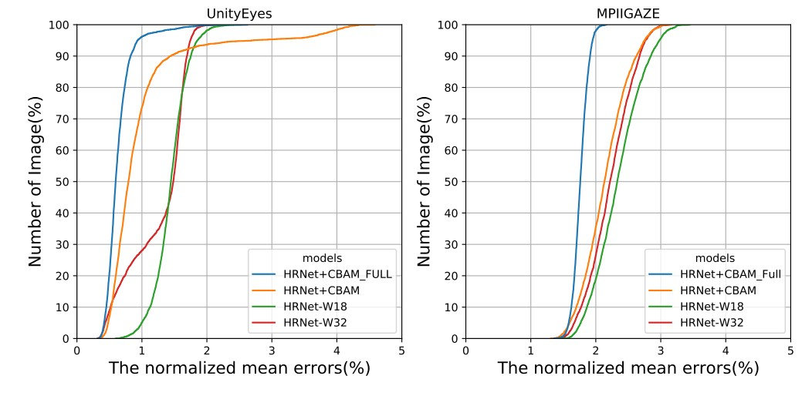
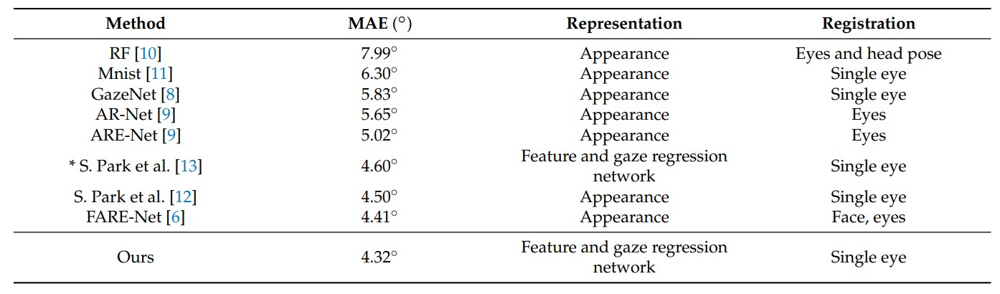
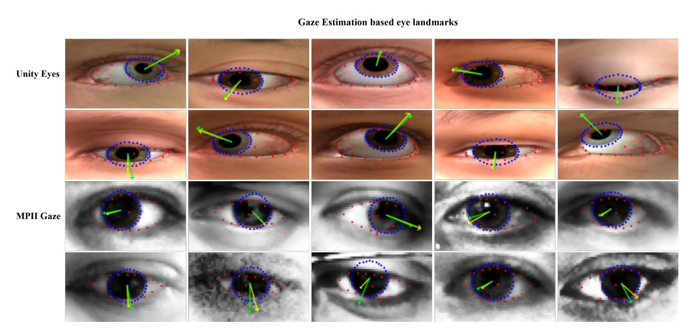
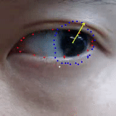

# Gaze Estimation Model Based on Eye Region in PyTorch

## News
-[2022/05/26] Our paper is published on MDPI Sensors : [Improved Feature-Based Gaze Estimation Using Self-Attention Module and Synthetic Eye Images](https://www.mdpi.com/1424-8220/22/11/4026)


## Introduction
We proposed the feature based gaze estimation method using 50 landmarks. We used [HRNet](https://arxiv.org/pdf/1908.07919.pdf) as backbone network and revised it applying attention moduel [CBAM](https://openaccess.thecvf.com/content_ECCV_2018/papers/Sanghyun_Woo_Convolutional_Block_Attention_ECCV_2018_paper.pdf). Then a gaze vector is obtained by accurate eye region features. We trained the model using the synthetic data [UnityEyes](https://dl.acm.org/doi/pdf/10.1145/2857491.2857492) and real-world-wild-settings data [MPIIGaze](https://ieeexplore.ieee.org/stamp/stamp.jsp?tp=&arnumber=8122058) and evaluate our method on MPIIGaze.    

  

## Performance

We evaluated gaze estimation and landmarks detection performance on UnityEyes and MPIIGaze.  

- The Landmarks Detection Performance.
<p align="center"></p>  

- The Gaze Estimation Performance.
<p align="center"></p>  

- The Outputs on UnityEyes and MPIIGaze (Green : ground-truth , Yellow : predicted)
<p align="center"></p>


## Quick Start  
#### Environment
This codie is developed using on Python 3.6.9 and PyTorch 1.7.0 on Ubuntu 20.04 with NIVIDA 3090 RTX GPUs. Training and testing are performed using 2 NVIDA 3090 RTX GPUs with CUDA 11.0 and cuDNN 8.1.0.  
 It also works well on Windows 10 
- Python 3.6.9 
- Pytorch 1.6.0 
- NVIDIA 1080 GTX, CUDA 10.1, Cudnn 7.0

#### Install
Install prerequisites with:
```bash
conda install forgaze
conda activate forgaze
# pytorch install
pip install -r requirements.txt
```

#### Demo
Red, blue and yellow are the eye region, iris region and gaze vectors, respectively.
<p align="center"></p>


```bash
python tools/demo.py
```

#### Train
Please specify the configuration file in `experiments` (learning rate should be adjusted when the number of GPUs is changed).
```python
python tools/train.py --cfg <CONFIG-FILE>
# example:
python tool/train.py --cfg experiments/unityeyes/eye_alignment_unityeyes_hrnet_w18.yaml
```


